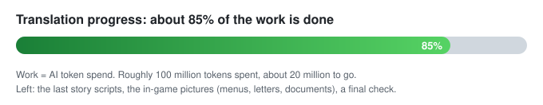

# Shigatsu Youka (死月妖花～四月八日～) English translation



## Play it in English: 3 steps

1. **Get the free Japanese game** (v2.0.0.4) from the author: https://www.freem.ne.jp/win/game/19917 . Unzip it anywhere.
2. **Download the newest patch zip** from https://github.com/Nostramadeus/shigatsu-youka-english-translation/releases/latest .
   Unzip EVERYTHING in it into the game folder, next to `死月妖花～四月八日～.exe`. Overwrite when asked.
3. **Start the exe.** That is it. No game file is modified; the engine loads the loose English files.

Good to know:
- **Boxes instead of letters?** Set Windows' system locale to Japanese (or run the exe through Locale Emulator) and add the Japanese language pack.
- **Do not use the game's own full-screen button** (second button on the toolbar). It resizes every other window. Use Magpie instead: `README-BEFORE-PLAYING.txt` in the zip explains it.
- **Do not look the game up online.** Store pages and wikis spoil its length and structure in the first paragraph.
- **Updating the patch:** unzip the new one over the old. Saves keep working.
- **Japanese text left somewhere?** Screenshot it (Win+Shift+S) and open an issue here.


Free LiveMaker 3 visual novel by New++ (freem game 19917, v2.0.0.4). The whole game is packed inside its 1 GB exe.
This repo holds only the translation (scripts, tables, pictures, notes), never the game.


## How this translation was made

Short version: an AI translated it, one human set the rules, answered its questions and spot-checked the result.

- **Who did what.** Claude (Anthropic). Opus 5.5 agents drafted and reviewed every line. A Fable 5.1 session orchestrated them, wrote the rule books from the owner's decisions, and reviewed the agents' output. The repo owner, one person, set the translation doctrine, answered the questions the AI raised, and proofread a sample by hand.
- **The human share, in numbers.** Read about 10 to 20 percent of the game in Japanese. Set the doctrine and the rules (ledger: `notes/v2/OWNER-RULINGS.md`). Answered about 40 translation questions. Proofread about 200 lines.
- **Pipeline, per part of the game.** Several translator agents draft from the rule books and glossary. Separate reviewer agents then check every line against the Japanese. Compile, run a QA pass for leftover Japanese and broken tags, ship. A question the agents could not settle got a provisional answer, was shipped, and was logged for the owner; the owner's answer became a rule for the next part.
- **What this means for you.** The text follows one set of rules from start to end, but past the opening it has had little human proofreading. Stiff, literal lines are intended (see the doctrine below). Mistranslations can be anywhere. The pages in `review/` show the Japanese next to each English line, so you can check a line and fix it.


## How to contribute

Fix a line, add a glossary term, extend the translation. Pull requests and issues both welcome.

**What is what**

| Folder | What is in it | Edit it? |
|---|---|---|
| `lns-en-55/` | the English story scripts, one file per scene block. This is the text players read. | **yes, main target** |
| `lns-en/` | the earlier English tree; a few early scripts still ship from it | yes, same rules |
| `tsv-en/` | English menus, notices, tutorial tips, navigator titles, synopses, encyclopedia | yes |
| `patch/` | per-script label / ruby / title tables, plus the two readme files that go inside the patch zip | yes, for wording |
| `work/グラフィック/`, `work/images/out/` | the English pictures: shipped `.gal` files and the English PNGs they were built from | through `tools/images/` |
| `notes/` | the translation rules (`v2/METHOD.md`, `v2/STYLE.md`, `v2/CORE-RULES.md`, `v2/OWNER-RULINGS.md`), glossary (`v2/GLOSSARY.tsv`), character voice sheets (`v2/CAST.md`), read-through summary (`v2/SUMMARY.md`), decisions log, open questions | read first; add a glossary row when you coin a term |
| `review/` | proofreading pages, Japanese left, English right, one per script | regenerate with `tools/render_review.py` |
| `tools/` | build scripts (pylivemaker): compile scripts, build tables, typeset pictures, assemble the patch | if you build |
| `research/` | what the author said about fan translations (the license) | no |

**Rules in four lines**

1. Literal translation, no localization. Keep the order of ideas and the images of the Japanese where English allows.
2. Honorifics stay (-san, -kun, -chan). Names are given name first.
3. A lost nuance gets a short translator note at the end of the line: `[TN: ...]`.
4. Never change a tag. `<STYLE ...>`, `<BR>`, `<PG>`, `<TXSPN>` and friends stay exactly where they are; only the English words between them change.

**Smallest useful contribution**

1. Open the script in `lns-en-55/` (the review page in `review/` tells you which file and line).
2. Change the English. Check `notes/v2/GLOSSARY.tsv` for the fixed rendering of names and terms.
3. Open a pull request. No git? Open an issue with file, line, and the suggested wording.

**Building the patch yourself (optional)**

You need your own copy of the game and `uv` (pylivemaker runs through it). Extract the scripts from the exe into `orig/` and `lns/` as the build section below describes, then `sh tools/compile_en.sh <id>` and `uv run tools/build_en_folder.py --zip`. Nothing extracted from the game goes into this repo: the author forbids publishing game data.

---


## License

The author (New++) wrote on ci-en (2026-07-29) two rules for fan work on this game:

1. **Fan translations may be published freely**, as long as they are clearly marked unofficial (非公式・二次創作). Every file we ship says "Unofficial fan translation (非公式・二次創作). Not affiliated with New++."
2. **Publishing data extracted directly from the game is forbidden**: program, images, audio, BGM, text data. Original wording: 「ゲーム本編のプログラム、画像、音声、BGM、テキストデータ等を直接抽出・複製して公開する行為」.

Where this repo stands on rule 2, honestly:

- **Kept:** the exe, the untouched scripts (`orig/`, `lns/`), the audio and the untouched pictures are not here and never will be. The patch adds loose files next to the player's own copy of the game.
- **Bent:** the English pictures in `work/グラフィック/` and `work/images/out/` are the game's own pictures with the Japanese text painted out and English set in its place. That is derived from extracted image data. We publish them anyway, because a translation that leaves the menus, tutorial and in-game documents in Japanese is not a translation, and there is no other way to translate text baked into a picture.
- **Bent:** the proofreading pages in `review/` show each Japanese line next to its English. Translators need the source to check a line. That is extracted text data, shown line by line, not the game as a whole.
- The compiled English scripts (`.lsb`) are only in the patch zip on the Releases page, not in git.

The rules cover the free version only. The author gives no help to translators; please do not contact them about this translation. Research and sources: `research/_author-satsuki.md`.

## Text format inside `.lns`

```
右を見ると、<STYLE ID="1">春花</STYLE>が私の肩にもたれ、すやすやと眠っている。
<STYLE ID="2">「</STYLE><STYLE ID="1">春花</STYLE><STYLE ID="2">、起きて。寝るなら、部屋に行こう」</STYLE>
```

`STYLE ID="1"` = character-name colour, `ID="2"` = spoken-dialogue colour. `<BR>` line break, `<PG>` page / click break, `<TXSPN>` / `<TXSPS>` text speed, `<EVENT>` / `<SCENARIO>` engine markers. Translate only the text; keep every tag and its order.

## Building the patch from the game files

The game is a LiveMaker 3 exe with everything packed inside. Tool: pylivemaker, run without installing through `uv` (`uvx --from pylivemaker lmlsb ...`).

| Folder (local, not in this repo) | What |
|---|---|
| `orig/` | every script / data file pulled out of the exe, untouched. Also the undo for any patch. |
| `lns/` | `lmlsb extract` output: the decompiled Japanese scripts with tags, one `.lsbref` plus several `.lns` per `.lsb`. The translation mirrors these names in `lns-en-55/`. |
| `work/` | compiled English `.lsb` files and the other loose files that make up the patch. |

1. Extract: `cd orig && uvx --from pylivemaker lmlsb extract <id>.lsb -o ../lns` (run inside `orig/`; the tool wants the project root).
2. Translate `lns/<id>-*.lns` into `lns-en-55/` with the same file names. Tags stay, `.lsbref` stays.
3. Compile: `sh tools/compile_en.sh <id>` writes `work/<id>.lsb` (it runs `lmlsb batchinsert` on a copy, never on `orig/`).
4. Tables: edit `tsv-en/*.tsv` (UTF-8), then `uv run tools/build_tsv.py` writes the CP932 copies the engine reads.
5. Assemble: `uv run tools/build_en_folder.py --zip` syncs the files listed in `tools/ship-list.txt` into the play folder and writes the patch zip to `patch/`.
6. Pictures: `tools/images/README.md`.

Half-width Latin text: LiveMaker renders English full-width by default; the shipped message-box file already switches it to a proportional font. Windows Defender sometimes flags the original exe; nothing in the patch touches it.
